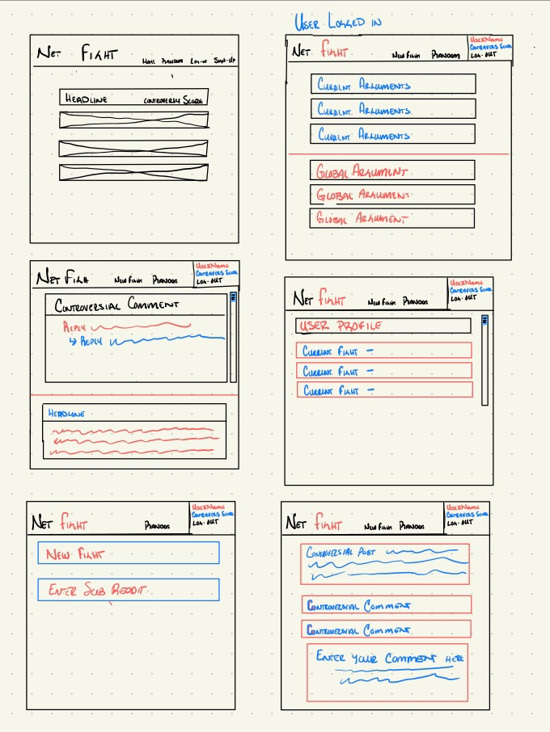

# Project Two with 

# Reddit API Fight APP
A web application that uses reddit's API to find the most controversial posts and displays them giving the user a safe place to release stress via arguing.

### Motivation
I am building this app as a part of my second project for General Assemblies Software Engineering bootcamp.

---
### Screenshots
[WireFrames]

---
### User Stories & Wireframes
The planning materials used to build this app.
* User will be able to log-in and create a unique username
* User will be able to see a list of controversial posts they ahve commented on via my app
* User will be able to search for new controversial posts by specifying the subredit the wish to find
* User will be able to make new comments stored within my application.

---
### Technologies & Code Snippets
* list of technologies
* screen captures of your code

---
### Credits
Give credit to any `codepen` that inspired you, `medium` article that helped you, or `stackoverflow` that pointed you in the right direction.

---

### Future development
What are the next steps for the project? How will you continue to evolve it?
